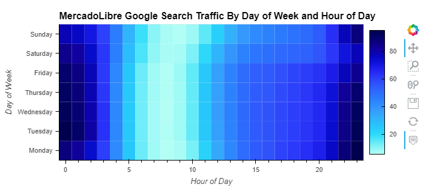
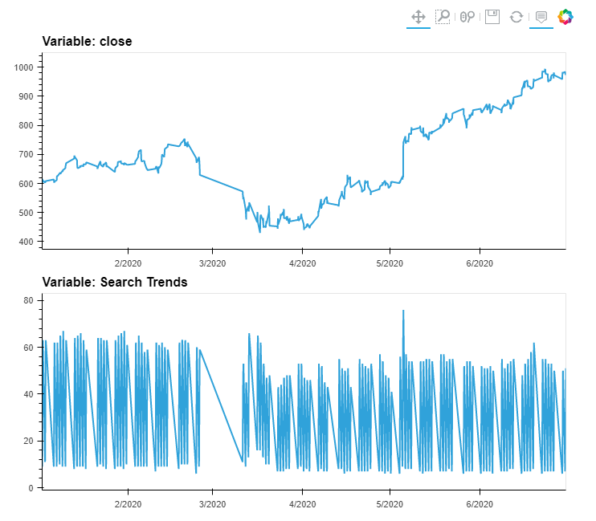
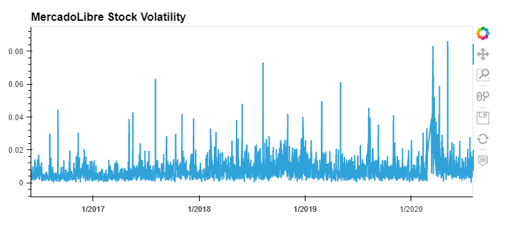
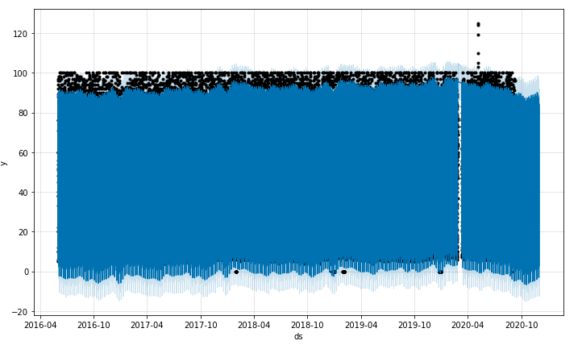
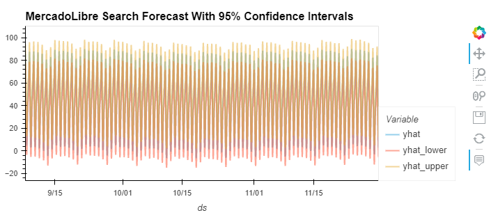
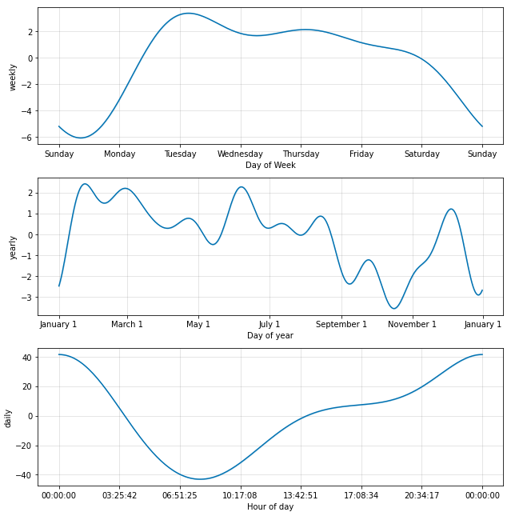
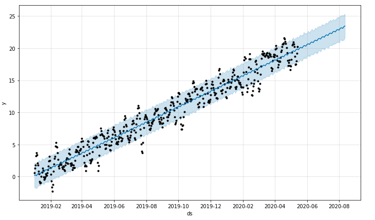

# Forecasting Net Prophet
The aim for this project is to find out if the ability to predict search traffic for the most popular e-commerce site in Latin America can translate into successfully trading the stock. My forecasting and analysis includes:

* Visual depictions of seasonality (as measured by Google Search traffic) that are of interest to the company.

* An evaluation of how the company stock price correlates to its Google Search traffic.

* A Prophet forecast model that can predict hourly user search traffic.

* A plot of a forecast for the company’s future revenue.

## Technologies

The Jupyter Notebook file was scripted with Google Collaboratory: a web IDE for python which enables Machine Learning with storage on the cloud. The required installs are Pystan, Prophet, HVPlot and Holoviews. CSV files containing the source data are included in a Resources folder. 

## Results

The Google search traffic was found to be concentrated on weekdays between 10PM and 2AM.

A common trend was observed where the reduction in searches in April 2020 accompanied a drop in the price. Also most notably a spike in searches in early May was matched by a sudden surge in the closing price.

Volatility spiked, and tended to stay high, during the first half of 2020.

By using Prophet we can see the forecast is for a dip in popularity for the latter part of 2020 with the bottom of the trough being in October before a partial recovery in the last to months leading to Christmas.

"yhat" represents the most likely (average) forecast, whereas "yhat_lower" and "yhat_upper" represents the worst and best case prediction (based on what are known as 95% confidence intervals).

Plotting hourly, weekly and yearly trends shows that midnight is the most popular time, Tuesday gets the most search traffic and October is the lowest point for the calendar year. 

Changing focus to revenue data shows the forecast for expected total sales next quarter is 969.6 Million USD. The best case scenario is 1051.5 Million USD and the worst case scenario is 887.7 Million USD (based on 95% confidence intervals).

## Contributors

Owen Harris.